# Project 1 - Motion Detection

## Introduction

Welcome to the first project of the course! In this project, we will ask you to employ many of the concepts you have learned in the previous modules to create a fully-functioning embedded machine learning system. The process will include collecting data, performing feature extraction, training a model, and deploying that model to an embedded system.

We will classify the motion and vibration data from a machine of your choice. This is to mimic using embedded machine learning in an industrial environment. We want to be able to determine if a machine is off, on, low, high, anomaly, etc.

Please note that at this time, we do not have a way to grade your project. As such, this project is considered optional to complete the course. However, we strongly encourage you to go through these steps to get hands-on experience with embedded machine learning as well as using the Edge Impulse tool.


## Required Hardware

You may use either your smartphone or [Arduino Nano 33 BLE Sense](https://store.arduino.cc/usa/nano-33-ble-sense) to complete the project. 

Whichever you choose, please stick with that device for data collection and deployment. Please do not mix them (e.g. collect data with the smartphone and deploy to the Arduino).

We recommend using the Arduino board, if you have access to it. There will be an optional section at the end of the project to modify the Arduino code. We encourage you to try this challenge to get a feel for working with embedded machine learning data.

You will also need some tape (recommended: electrical tape) to secure your board or smartphone to the machine.

## Setup

Before we start collecting data, we must first figure out what we want to monitor! In the previous lectures, we constructed a “magic wand” demo that classified person-made hand movements. In this project, we will work with machines to classify operating modes and look for anomalies. While the “magic wand” is a fun way to interact with machines, we’ll look at possible industrial uses for embedded machine learning in this project.

To begin, choose a machine in your home, office, or school that produces some kind of vibration data that you wish to monitor and classify. Here are some ideas of things you may want to monitor:

* Washing machine
* Blender
* Air compressor
* Refrigerator
* Air conditioner
* Keyboard (typing)
* Ceiling fan

I will show photos from my clothes dryer to demonstrate how to set up the project, but please feel free to extrapolate them to your own chosen device.

## Connect Device to Edge Impulse
Create a new project on Edge Impulse. Give the project a name, such as “industrial-motion-classifier.”

**If you are using your smartphone:**

In your Edge Impulse project, go to Devices and click Connect a new device. Click Show QR code next to Use your mobile phone. Use your phone to scan the QR code and click the link that appears. Make sure that your phone shows up in the Edge Impulse devices list.

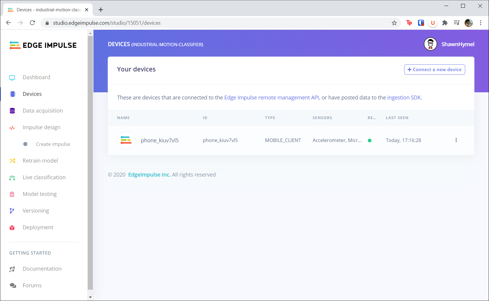

**If you are using the Arduino board:**

If you have not done so already, follow the steps in [this article](https://docs.edgeimpulse.com/docs/arduino-nano-33-ble-sense) to install Node.js v12 (or higher), Arduino CLI, and the Edge Impulse CLI.
Download the Edge Impulse firmware from [this link](https://cdn.edgeimpulse.com/firmware/arduino-nano-33-ble-sense.zip). Follow [Update the Firmware steps](https://docs.edgeimpulse.com/docs/arduino-nano-33-ble-sense#2-update-the-firmware) in the same article. Double-click the reset button on the Arduino board to put it into bootloader mode. Run the flash script in the .zip file (.bat for Windows, .command for macOS, .sh for Linux) to upload the EI firmware to the Arduino. When the flashing is complete, press the reset button once on the Arduino board.

Open a command terminal and enter the command:

```bash
edge-impulse-daemon --clean
```

Note that the “--clean” option will allow you to connect your Arduino board to a different project (if you have already connected it to a different project in the previous lectures).

Follow the prompts to log in, choose the serial port connected to your Arduino board, and connect to your new project.

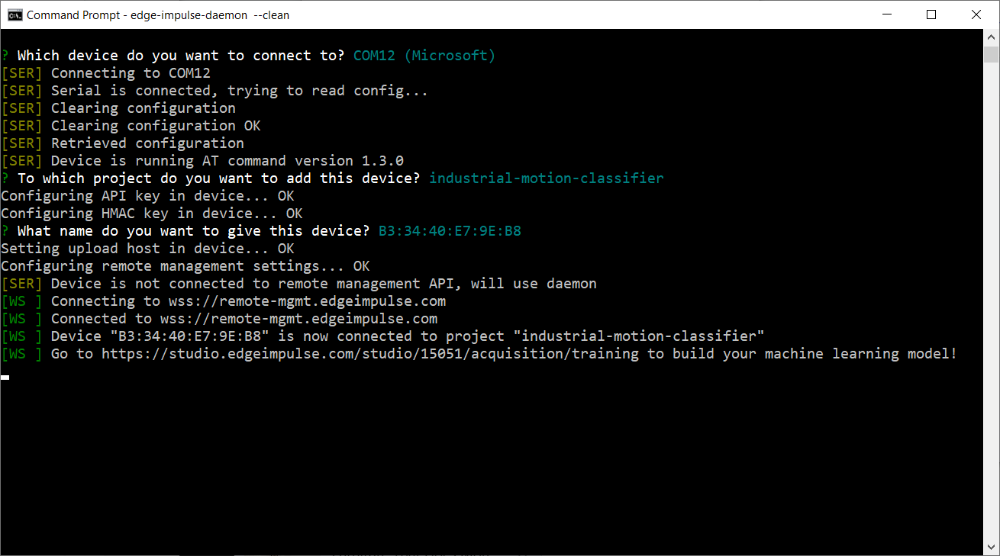

Go back to your Edge Impulse project and verify that the Arduino board is connected.

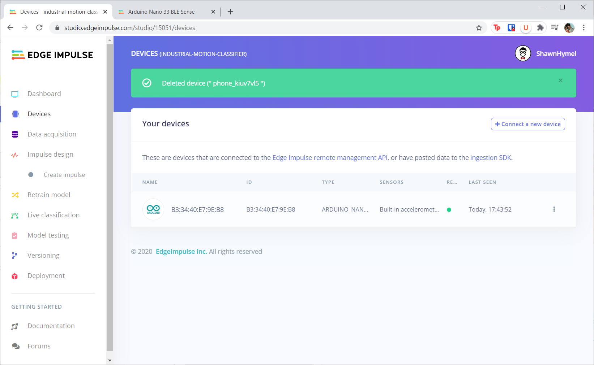

## Attach Device

**If you are using your smartphone:**

Attach the phone to the machine as best as you can with some tape and leave space so you can access your screen

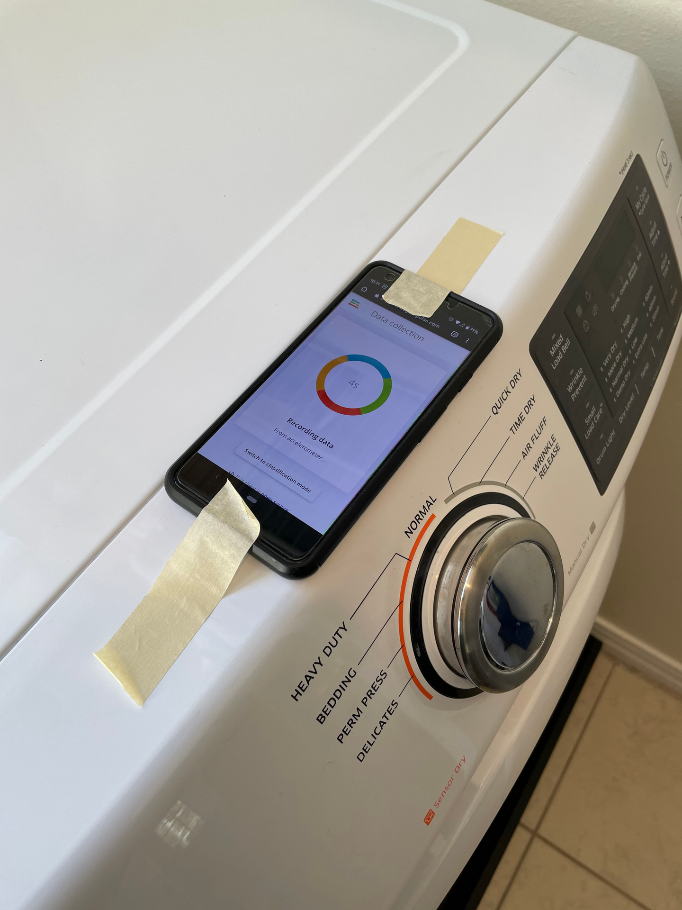

Make sure your phone is connected to your Edge Impulse project by navigating to smartphone.edgeimpulse.com on your phone’s browser.

**If you are using the Arduino board:**

Use some tape to adhere your smartphone or Arduino board to your chosen device. If the device is metal, I recommend putting a layer of tape down as a barrier to prevent the Arduino’s pins from shorting together.

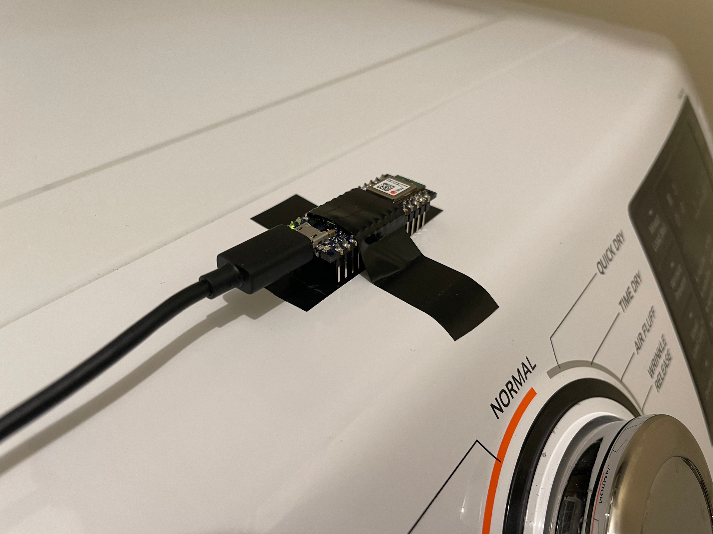

Note that you will need to connect your Arduino board to your computer. Because of this, I recommend using a laptop (if you have one) near your Arduino board. Connect your Arduino to your computer using a USB cable.

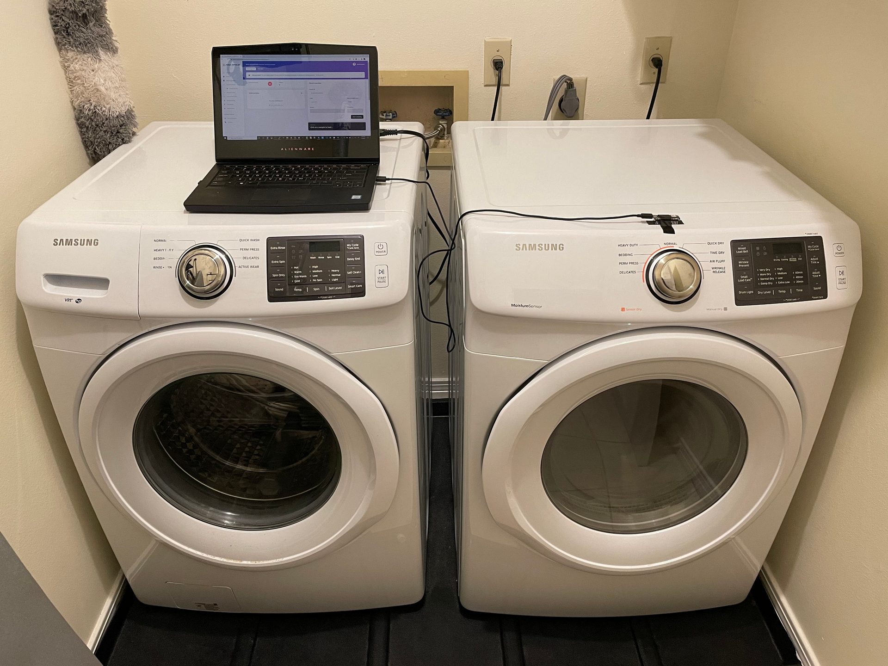

## Data Collection

Head to the Data acquisition page in your Edge Impulse project. Your device (if connected) should show up on the right side of the window. If not, follow the steps above to connect a device to your project.

You will need to choose a few classes for your model to be able to predict. For example, I want my model to be able to identify when my dryer is in one of the following states:

* Off
* Light load
* Heavy load

For my project, a “light load” is 1-4 towels and a “heavy load” is a blanket and 3-6 towels. Notice that I vary the amount of towels in each class (e.g. 30 seconds of data with 1 towel, 30 seconds with 2 towels, and so on). That’s because a “load” can mean a range of things, and I want to create a model that’s robust enough to identify a range of loads within each class.

Have your machine run in the desired state. Collect at least 2 minutes of accelerometer data for each class. When you’re done, you should see the collected data filled out with samples. Don’t forget to label your class before you start collecting data!

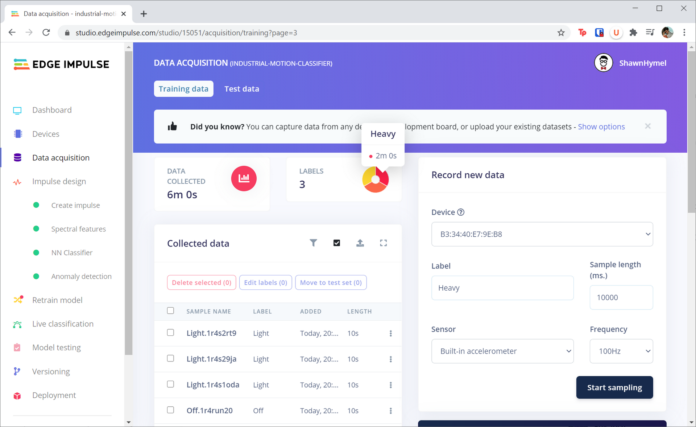

When you’re done, repeat the process for the test data. However, you only need to collect about 30 seconds of data for each class.

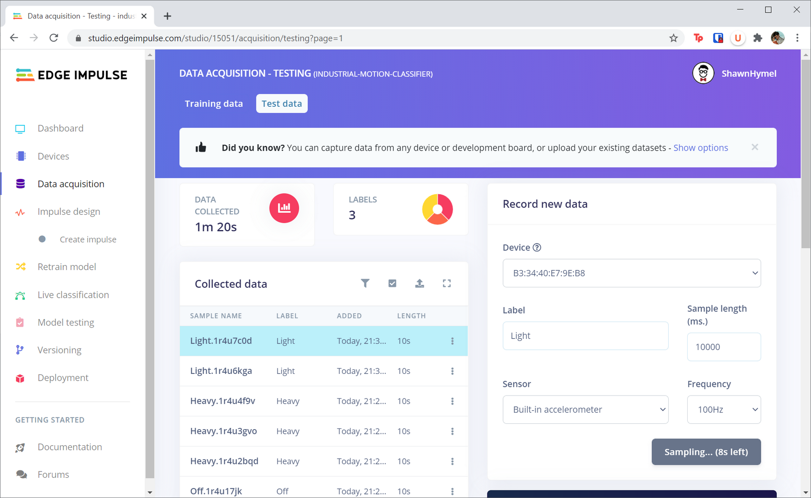

## Feature Extraction

Head to the **Impulse design** page in your project. Add a **Spectral Analysis** processing block. Add a **Neural Network** block and a **K-means Anomaly Detection** block to the learning blocks section.

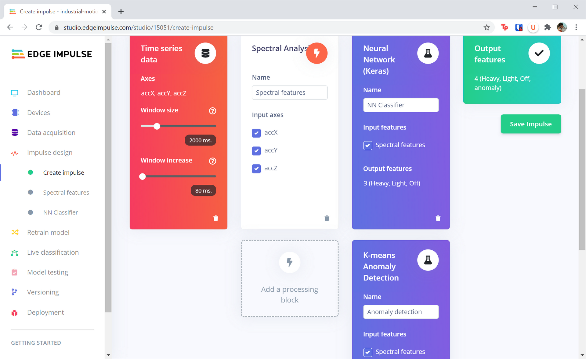

Head to the **Spectral Features** page and click **Generate features**. Take a look at the *Feature explorer.* What patterns do you see in the samples? Can your classes be easily separated?

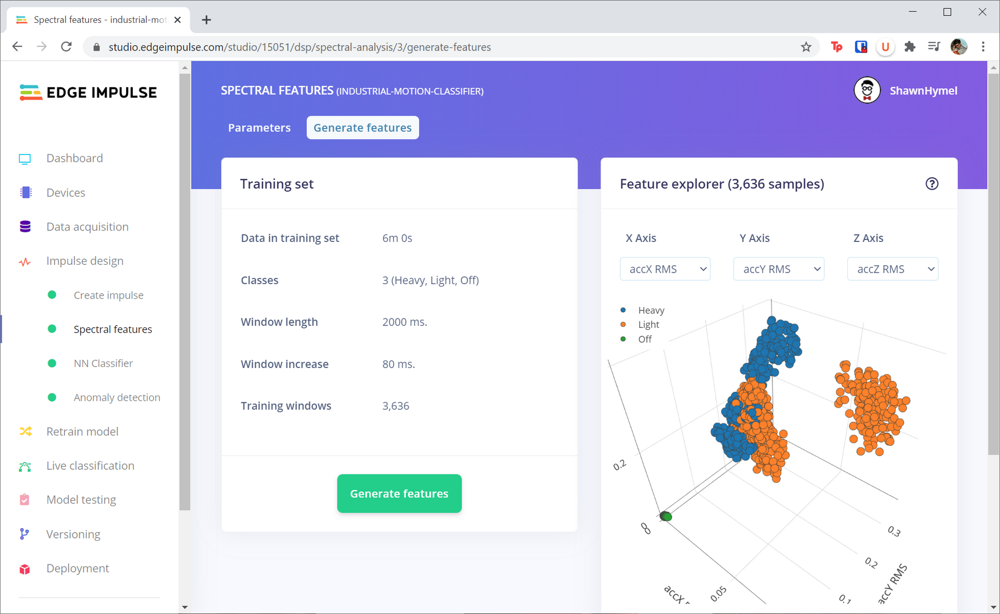

Try changing the X Axis, Y Axis, and Z Axis parameters in the Feature explorer. Which features offer the best separation among the groupings of labels? As you can see in my screenshot above, RMS offers decent separation. The neural network may have a hard time discerning some of the light samples from the heavy samples using just RMS. However, it’s the best separation I could find with just 3 features.

Write down which set of features offers the best separation. You will want to select these features in the Anomaly Detection section.

## Model Training

Head to the **NN Classifier** page in your project. Click **Start training**. After a few minutes, the model should be done training.

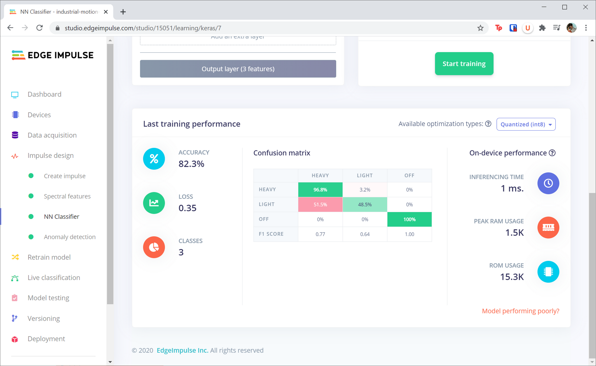

Scroll down and take a look at your confusion matrix. You should see good accuracy for not just the whole model but within each class. For example, it looks like my model has a habit of labeling “light” samples as “heavy.” Are these false positives or a false negatives?

If you’re not happy with the results (like I was), try changing some of the hyperparameters and train again! For example, I increased the training cycles to 100 epochs (instead of 30). I also added another neural network layer and increased the nodes in each layer to 40. This seemed to help increase the accuracy of the model.

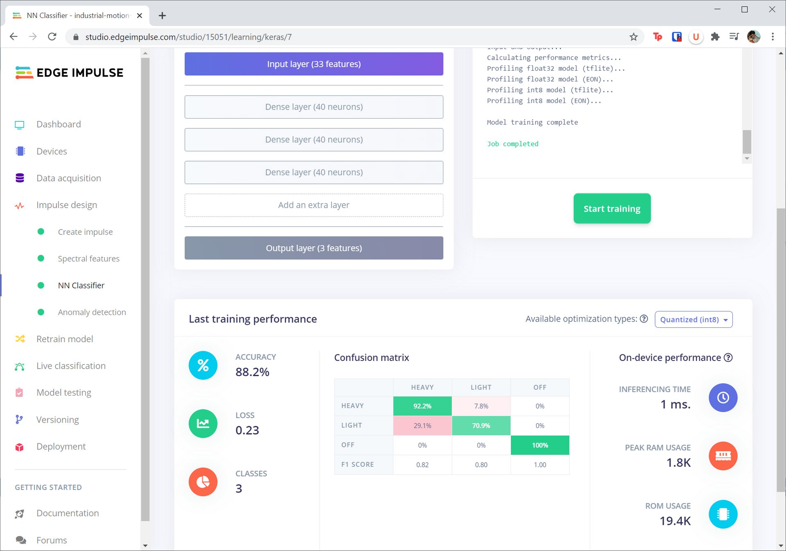

Be careful of overfitting! If you see that the validation loss is much higher than the training loss (look carefully at the training output), your model may be overfit. In that case, try reducing the number of nodes or layers in your model and try again.

The ultimate goal is to find the smallest neural network (smallest number of nodes and layers) that meets your needs. As you increase the number of nodes and layers, you increase the computational complexity of the model, which requires more resources in your microcontroller.

Ideally, you want your validation accuracy to be in the 80-95% range, depending on your application. Note that the confusion matrix is computed with the validation set (not the training set).

Go to the **Anomaly detection** page of your project. Select the features that you wrote down in the previous section (these will most likely be the RMS values for the X, Y, and Z axes). Click **Start training**. When that’s done, you should see your features with their clusters in the *Anomaly explorer*.

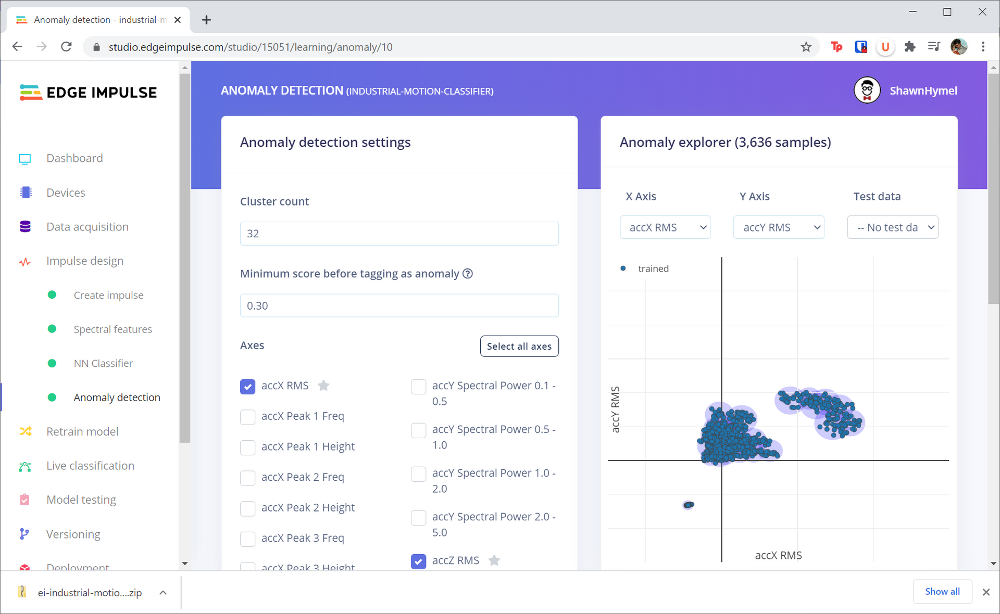

## Model Testing

Go to the Model testing page in your project. Click the checkbox next to Sample Name to select all of your test samples. Click Classify. After a few moments, your test set should be classified using the model you trained.

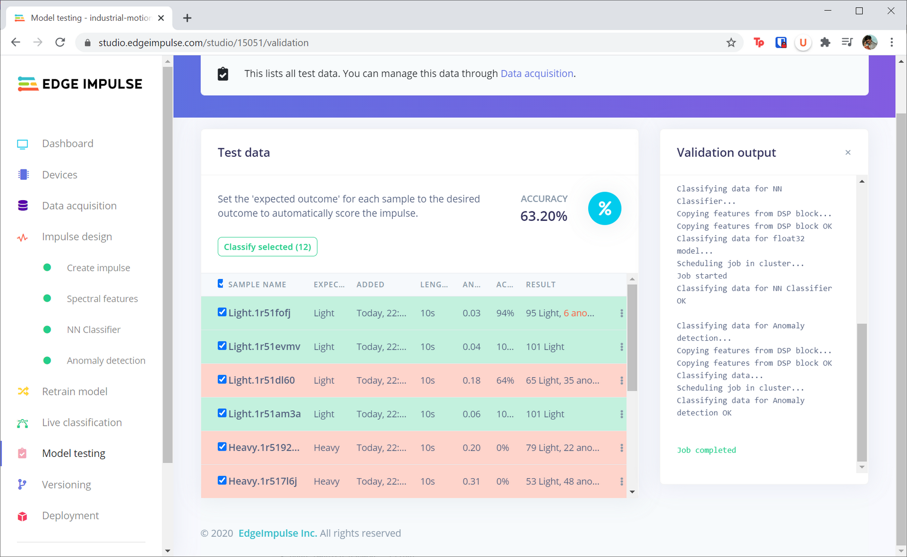

Notice that my test accuracy is not very good. If you see something less than about 65% accuracy, your model may be overfit or underfit. Try collecting more data and adjusting some of the hyperparameters.

**Be careful!** Each time you update your model’s hyperparameters because of some new information from the test set, you then begin introducing bias into your model, such that it may overfit the test set as well. At this point, your test set is no longer a test set, but rather a secondary validation set. 

I recommend gathering new test data if you plan to adjust the hyperparameters and re-train the model at this point. You can move your test samples to the training set if you wish (in Data acquisition > Test data). Also, if you go to the Dashboard for your project, you can click Rebalance dataset to have Edge Impulse automatically group your training and test datasets together and then randomly split them up again into training and test sets.

That being said, I’m happy enough with 60% performance on my test set. I’m mainly interested in finding anomalies for this particular project (note that your needs may be different! You may want a classifier rather than an anomaly detection system).


## Deployment

Make sure that your smartphone or Arduino board is in the same spot as when you collected data! If you move it, you could affect the accelerometer readings.

**If you are using your smartphone:**

In your phone’s browser, head to smartphone.edgeimpulse.com to reconnect the phone to your project. Click the Switch to data collection mode button at the bottom of the page. The phone will automatically have Edge Impulse build your project and download it. From there, it will run locally on your phone’s browser.

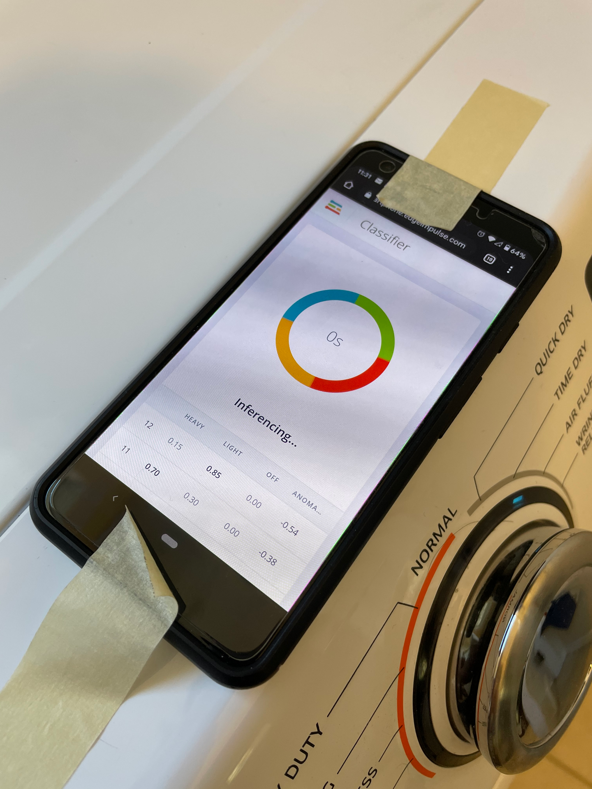

Take a look at the output of the class predictions. As you can see in my photo, my model has a hard time distinguishing between the light and heavy classes (just like I saw in the test set). However, it is effective in determining if the dryer is on or off. Additionally, when I put a pair of shoes in the dryer, it is immediately flagged as an anomaly during inference:

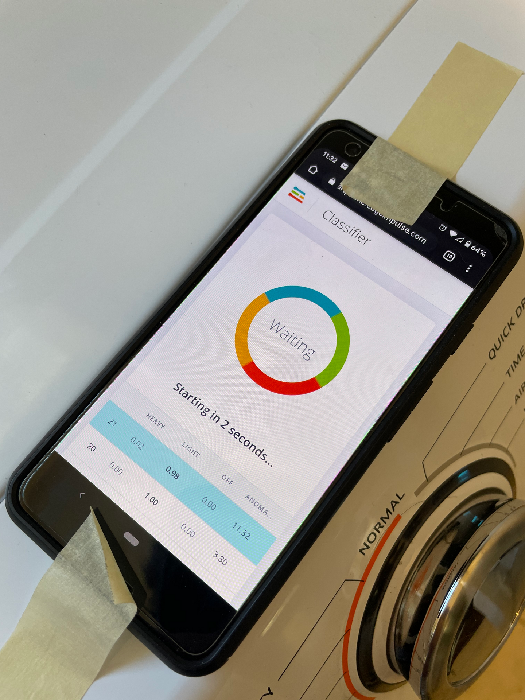

The anomaly value shoots up from below zero to over 0.3 (the default anomaly threshold) very quickly!

For now, I’m happy being able to determine if my dryer is on, off, or has an anomaly (off-balanced motor or large, heavy object causing odd vibrations). However, if I wanted to create a more accurate classifier, I would need to spend more time tweaking hyperparameters, gathering lots more data (e.g. use objects other than towels and blankets), and trying different model architectures.

**If you are using the Arduino board:**

Head to the **Deployment** page in your Edge Impulse project. Click on **Arduino library**, scroll down, and click Build.

Once your project has been downloaded, open the Arduino IDE. Go to **Sketch** > **Include Library** > **Add .ZIP library**. Select your downloaded .ZIP file from Edge Impulse. Go to **File** > **Examples** > **your-project** > **nano_ble33_sense_accelerometer**.

Feel free to examine the demo code generated by Edge Impulse. Click Upload to compile and send the program to your Arduino board. This may take over 10 minutes to compile and upload.

When it’s done, open a serial monitor. Run your machine in the various modes to see if your Arduino can correctly classify the mode. For example, in the screenshot below, I have 3 towels in the dryer (notice that the “light” label has the highest value):

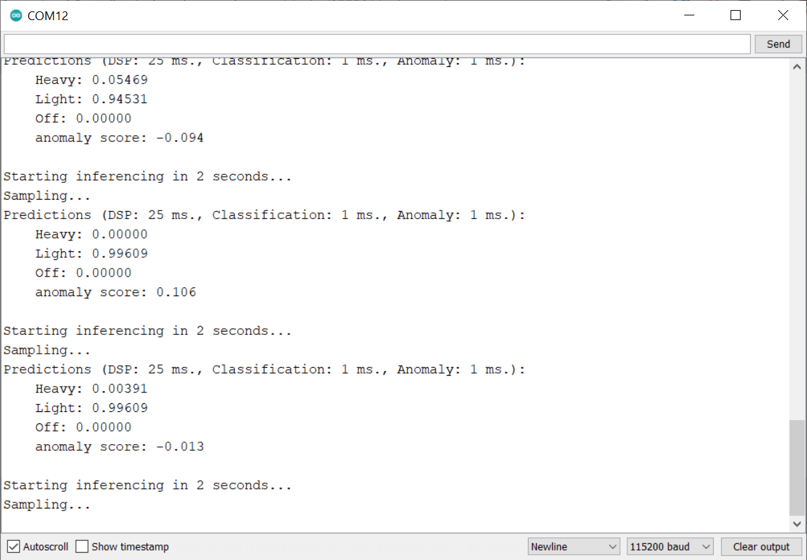


I also recommend trying to set off the anomaly detection system. For example, the motion detection system reports this when I put 1 towel and a pair of shoes in the dryer (notice that the “anomaly score” is above 0.3):

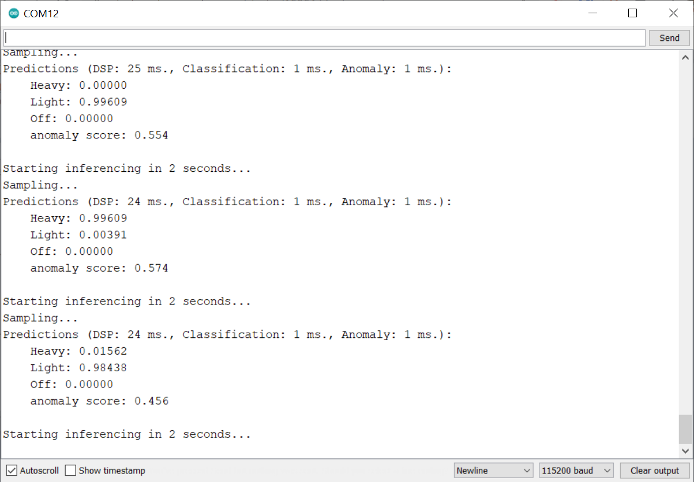

## Challenge

If you are using the Arduino, try flashing the Arduino’s onboard LED whenever either a particular class or anomaly value is above a threshold. What threshold you choose is up to you. I recommend starting with 0.6 if you’re using a class label or 0.3 if you’re using the anomaly score.

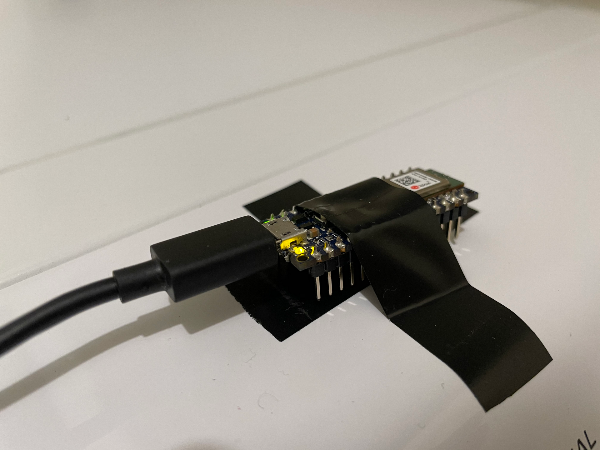

## Conclusion

I hope that this project has helped you see how machine learning can be employed to characterize various operating modes in machines and detect anomalies. Evaluating operation of a machine without needing to modify the machine itself can be useful in diagnosing problems before they occur.

The other lesson is that machine learning can be a messy process sometimes. Adjusting hyperparameters to get a decent classifier can be something of an art, and the experimentation process can take time. Additionally, machine learning models can be “good enough” for your needs. You don’t need to spend months constructing a perfect classifier if you’re mostly concerned with spotting anomalies (unless classification is important to solving your problem).