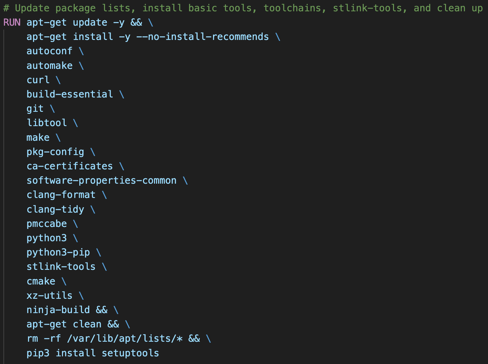
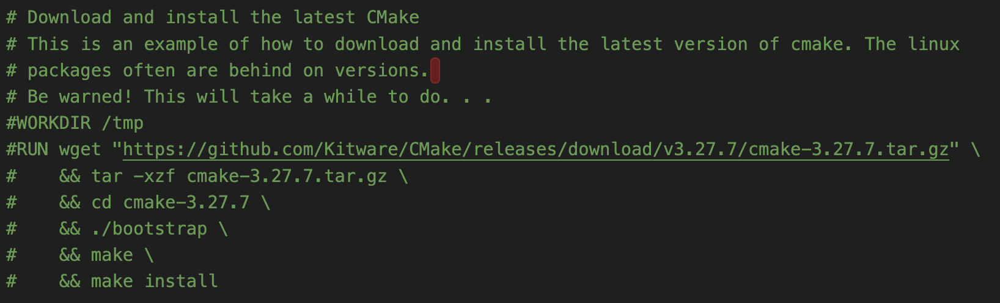
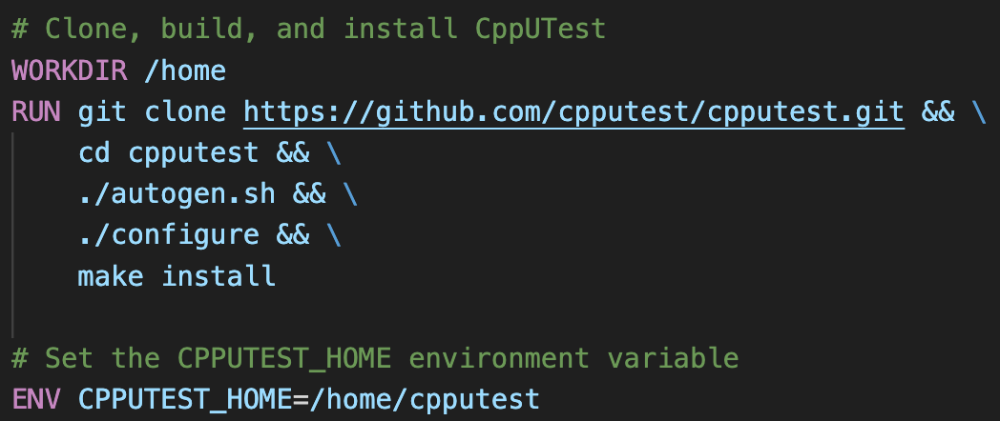

# Modern Embedded System Development Environment

1)   Over the next few days, I’ll send be sending you tips and suggestions for how to leverage the example build system. To ensure you can receive all the emails, please add the following to your “safe sender” list:

2)  Next, you can download the Modern Embedded Build System by Beningo resource by clicking the download button below:
Download Here

3)  Save the resource zip file to a safe location. 

4)  Unzip it to a “working directory”.

5)  Finally, open the README.md file in your favorite IDE and review it. It will guide you through building and running the supplied Docker container.

You’re now on your way to leveraging a modern build system that will enable flexible software development, testing, simulation, and CI/CD integration! 

Yesterday, you downloaded the Modern Embedded Build System by Beningo Example project and had the opportunity to get Docker up and running. You also verified that you could run unit tests by running the command. 

Today, I want to point out a few areas you might modify to make the build system compatible with your projects. 

Here are a few simple next steps that you’ll need to take today that will only take 5 minutes:

In the config folder, open toolchain-host.cmake. Examine the contents of the file. You’ll notice that this toolchain file is used to run the code in simulation mode on your host. 
The compiler settings are set to a minimum. For example, using `C17` and `C++17` with hardly any flags set. You can customize this file for your own simulation needs. 
In the config folder, open toolchain-arm.cmake. Examine the contents of the file. You’ll notice that this toolchain file has much more than the simulation target. 
I’ve documented the toolchain file extensively for you. Read through to understand what the file is doing and its settings. 
I’ll point you to look closely at the `-D` definitions. Those are all ST Microelectronics-specific! If you use these with your own targets, you may need to update these options. 
You’ll also notice a section on compiler flags. You can uncomment commonly used flags or add/remove them for your own needs. 
Finally, if you look at the high-level `CMakeLists.txt` file, you’ll see how all of this is pulled together into a single cohesive framework. If there is anything you are not sure about, feel free to put the code into your favorite generative AI tool to gather additional insights. 
**Note**: In each directory, individual code files are added to the build through CMakeLists.txt files. 

Yesterday, you started to get familiar with the CMake build system and the toolchain files that we use for target and simulation builds. 

Today, I want to show you how to customize the Docker container. 

Let’s start by having you open the Dockerfile, which is in the docker folder. Here are a few simple next steps that you’ll need to take today that will only take 5 minutes:

1. First, notice that we start our Dockerfile with the following:

   `FROM ubuntu:22.04`
    We are telling Docker that we want to use Ubuntu for our container. We could specify that we want to use the latest instead of 22.04. However, specifying a specific version can ensure that you don’t run into compatibility issues. 

2. Next, you’ll notice a long RUN command as follows:

Take a moment to look through these packages. If you don’t think you need a package, you can erase it! If there are other packages that you think you might need, you can also add them here!

3. A little bit further done in the Dockerfile, you’ll notice the following commented-out code:

Why would I do this? Well, this is an example of how you can install a specific version of a tool. I mentioned earlier that we might not want to rely on the Linux packages to provide the right version. They might have cmake 3.27.7 today and then cmake 3.32.4 tomorrow.It’s possible that could cause a problem. Then again maybe not. 

 To try this out, remove the CMakeeinstallation from the RUN command I showed you earlier and uncomment this code. Rebuild your docker container in the terminal using the command makedocker_image

4. If you look a bit further down, you’ll find the text:

    `# Install GNU Arm toolchain(Version 13.2.Rel1)`
    This example shows you how to download a zip file, unzip it, install it, and set the path. If you look at the first RUN command, you’ll see us adding certificates and other utilities to successfully interact with websites. 
    **Note:** It's crucial to stay updated as compiler vendors often change file storage locations. You might need to update them periodically. Alternatively, you can download them to a specific location on your server for consistent access. This way, the path remains unchanged! 

5. Finally, you’ll see a section that looks like the following:

This example shows you how to install cpputest, a unit test harness. The great thing about this example is that it shows you how to clone a git repository and run several scripts to configure the tool. 

If you're not yet convinced by cpputest, consider exploring Google Test. (Hint: It could be an intriguing experiment for you!)

