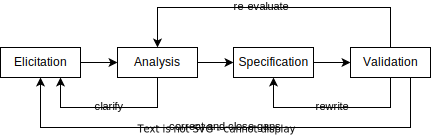

# Course 1 - Requirements Gathering for Secure Software Development (University of Colorado Springs)

* **Requirements Engineering: The Basis of Software Development**
## Requirements Elicitation for Secure Software

### Practices and People
* Elicitation - Why?
	* What are Software Requirements Specification (SRS) documents?
		* A description of the woftware to be developed
			* Functional Requirements: what the system should do/
			* Non-Functional Requirements: how the system should operate (i.e. security, performance, maitainability, modularity, modifiability, etc...)
	* Why do we need them?
	* Why are they challenging to write?
* Making Bad Requirements - User Involvement Challenges
	* Customer: "But just one more feature...that can't be hard!"
	* Requirements writer: "This isn't clear, so we'll assume"
	* Developer: "I bet they'd like this too!"
* Making Bad Requirements - Poor Planning
	* We drew it on this napkin/white board. Don't lose it.
	* Ambiguity - costumers to developers
	* Guessing at effort needed
	* Assuming requirements

### Getting Started - "I want THIS"

* Someone comes with a case:
	* I work im immunology, and I want a website that will search a database and report all severe outbreaks of the disease that I searched for. My boss has hired you to construct the site.
	* I want you to develop a set of requirements to describe what you're going to produce,
		* Given this:
			* Develop a set of requirements to describe what you're going to produce.
#### Who will you need to talk to?
#### What information do you need to learn?
#### Considerations
* What is "severe"?
* What already exists?
	* Is there a database?
	* Is there a known API?
* By the way, interns are not allowed to use the database.
	* Which means that people must be logged in with proper qualifications
		* Which leads to the question: what are proper qualifications?
* This comes to the conclusion that you **MUST ALWAYS ASK WHY**( You'll probably feel like a 5 year old sometimes.)
* Software is tricky and costumers often lose the sense of responsibility over the product and is up to you to figure that out.
* Costumers will look at you and say: "You handle the computer stuff". Your job is to convert "costumer stuff" to "computer stuff".

### Introduction to Requirements Engineering 
* Requirements Engineeriging
	* Requirements Development:
		* Elicitation;
		* Analysis;
		* Specification;
		* Validation.
	* Requirements Management.
#### Goals
* The main goal is to make software requirements.
* A software requirement is:
	* A software capability needed by the yser to solve a problem to achieve an objective;
	* A software capability that must be met or possessed by a system or system component to satisfy a contract, standard, specification, or other formally imposed documentation.

#### Roadmap to Success

* Wading through the problem domain
	* Our responsibility to understand the stakeholder's problems, culture, language and needs;
* Moving to a solution:
	* Develop lists of features from needs;
	* Simple descriptions in the user's language.
* General Requirements:
	* Specifications need to impose on solution/
* System meets the requirements -> promised feature is delivered -> understood needs are met.

#### Costumer-Development Relationship

* Costumer: Individual or organization who derives direct on indirect benefit from the product
	* Project stakeholders and product users
* Stakeholders/senior management/hirers:
	* Establish product vision and product scope
	* Define the business requirements.
* OBS: quite often their are far and/or removed. You can't to them, you don't have access to them or they are hard to find. It is challenging to talk to people or trying to connect.
* End-users:
	* Will use the product directly or indirectly;
	* Can describe the tasks they need to perform;
	* Can describe the quality characteristics they expect;
* Business vs User Requirements:
	* Business: people with the money;
	* User: people who press the keys.
	* OBS:
		* Business requirements may go against your end-user desires and they need to be negotiated;
		* Business requirements are different from business rules:
			* Business rules are covering regulations, policies, formulas, events. They are needed to define constraints and give you definitions.
			* Business requirements on the other hand focus on what the business people want.
			* You need to take a look at both of these. They both come into your requirements. The user requirements from all of these groups (business requirements, end-users, business rules) will help you to see how people really need to use the product.

#### Desirable Qualities of Requirements

* Each statement should be:
	* Complete;
	* Correct;
	* Feasible;
	* Necessary;
	* Prioritized;
	* Unambiguous;
	* Verifiable.
* Specifications should be:
	* Complete;
	* Consistent;
	* Modifiable;
	* Traceable.

### Software Cycles

* Requirements;
* Design;
* Implementation;
* Testing;
* Management.

#### Requirements and the Software LifeCycle

* Who does what? When? How?
* Waterfall Model (1970):
	* Activities proceed logically through steps;
	* Each step based on previous steps;
	* Added feedback loops between stages;
	* Develop a prototype system in parallel with requirements and design;
	* Plan and Document:
		* Often hundreds or thousands of pages!
		* Define everything;
		* Record all assumptions;
		* Explain all reasons, alternatives and links;
		* Often takes years to complete.
* The Spiral Model (1988):
	* Multiple feedback opportunities;
	* Too rigorous, not enough time;
	* Tends to fail because it takes to long and costumer views, technologies and circunstances change.
* Iterative Approach (1995):
	* Lifecycle phases decoupled from software activities;
	* Each iteration designed to mitigate present activity risks.

#### Hybrid Model/Iterative Lifecycle Approaches

* Requirements - Iterative Model
	* Advantages:
		* Better adaptability to requirements change;
		* Better scope management.
	* Disavantages:
		* The requirements change and it causes the model to fall apart.

### Agile Development LifeCycle

* Iterations involve the costumer before the product is completed, which reduces chances of misunderstandings. However, iterations are usually 6 to 24 months long, so there is plenty of time for costumers to change their minds!
* "And the users exclaimed with a laugh and a taunt: It's just what we asked for, but not what we want."
* Agile Manifesto, 2001: "We are uncovering bettwe ways of developing SW by doing it and helping others do it. Through this work we have to come to value."
	* Individuals and interactions | over processes and tools;
	* Working software | over comprehensive documentation;
	* Costumer collaboration | over contract negotiation;
	* Responding to change | over following a plan;
* That is, where there is value in the items on the right, we value the items on the left more.

#### Agile's Impact on Requirements

* We need to be able to change quickly, rather than following a very set plan like we did in the Waterfall Model;
* The agile dev cycle changes how we look at requirements and everything else within the software development lifecycle:
	* We have more communication with user;
	* Less/different documentation;
	* Many more documentation changes. But, the more communication, the more you learn!

* Eliciting Requirements Catchup:
	* Avoid technical jargon with non-technical stakeholders;
	* Be very respectful;
	* Explain all work products that are being created from requirements process;
	* Provide ideas and alternatives (that may be more efficient / cost less);
	* When requirements change, be honest about the changes in estimates. The changes may include materials, costs and other things

#### The Analyst

* **Responsibilities**:
	* Gathering requirements;
	* Analyze requirements;
	* Document requirements;
	* Validate requirements;
* **Working with a team**:
	* Serve as a link between costumers to developers;
	* Keep requirements development alive;
	* Manage activities as requirements change, new insights are made, or risks appear.

#### Lines and Cats- An interesting look at requirements gathering

* [The Expert](https://www.youtube.com/watch?v=BKorP55Aqvg)

Please watch the above video.  Warning- It's ridiculous. Really- it's a nightmare situation.  However, there is much we can learn from it.  Think particularly on these  points in how you would react.

1) How do you react to your customer and to your boss?
Answer: ask questions to validate the requirements, such as: "You want us to draw a red line with green ink?". Make sure that the costumers understands what they are asking.
2) How do you get good ground information that is useful?
* Getting ground information:
	* Have them give examples (drawings help!)
	* Draw your info too to compare your understanding;
	* Beware of scope creep!
	* You're trying to get a hold of the high level goals of the project;
	* Take notes as the stakeholders talk;
	* Ask for clarifications on definitions. They may not fit what you're currently thinking about. You may not even know what the word actually means;
	* Having the stakeholder walk through the product first helps with understanding quicker what is they're thinking about, regardless of what words they're using;
	* 
-- Think about every statement that is made by the customer and the "expert."  How would you respond?

3) How do you deal with the boss?

* Be respectful;
* Make notes of points to bring up LATER;
* Perform cost and risk analyses;
	* Have alternatives to present to the boss and the costumer;
	* The best approach is to come up with a cost x risk analysis matrix to your boss and ensure your job is safe.

#### Who, When, Why and How?

* Why:
	* Contextual reasons must be made explicit;
		* Identify limitations of the system-as-is;
		* Explore opportunities to be exploited;
	* Complete, consistent, adequate, unambiguous, verifiable, feasible, necessary;
* When:
	* Depends on LifeCycle Models.

### Requirements Engineering Statement Types

* Requirements:
	* Prescriptive statements about:
		* Software functionalities;
		* Software qualities;
		* Development constraints
	* Expressed in vocabulary of the **problem world**

### Requirements Engineering Other Statement Types

* Domain properties: descriptive statements about this world;
* Assumptions: expected behaviors or environmental components;
* Definitions: precise, complete, agreed meaning for domain concepts and terms.

### Requirements Challenges

* Just to name a few:
	* Appropriate assumptions;
	* Identify correct domain properties;
	* Elaborate correct requirements.
* Common Misconceptions:
	* Not about the software alone;
	* Not a translation of pre-existing problem formulations;
	* Cannot be done without design;
	* Domain properties are set. Requirements may change;
	* "Precise" does not mean "formal";
	* Set of notations may be necessary, but may not be sufficient.

### The Analyst - Who and What?

* Eliciting requirements:
	* Understand system-as-is and context in which it works;
	* Calling for a new system;
		* Problems and opportunities;
	* Identify real needs;
	* Explore alternatives.

#### More Analyst Tasks

* Write requirements specifications;
* Model the requirements;
* Lead requirements validation;
* Facilitate prioritization;
* Manage requirements.

### Knowledge Acquisition

* Knowledge of the organization;
* Knowledge of the domain;
* Knowledge about the system-as-is;
* Result: preliminary draft proposal.

#### Identifying Stakeholders

* Relevant position in organization;
* Decision-maker for the system-to-be;
* Level of domain expertise;
* Exposed to perceived problems;
* Influence in system acceptance;
* Personal objectives and conflicts of interest.

### Obstacles in Data Handling

* Handling obstacles:
	* Distributed and conflicting sources;
	* Difficult source access;
	* Obstacles to good communication;
	* Tacit / hidden knowledge;
	* Sociopolitical factors;
	* Unstable conditions.
