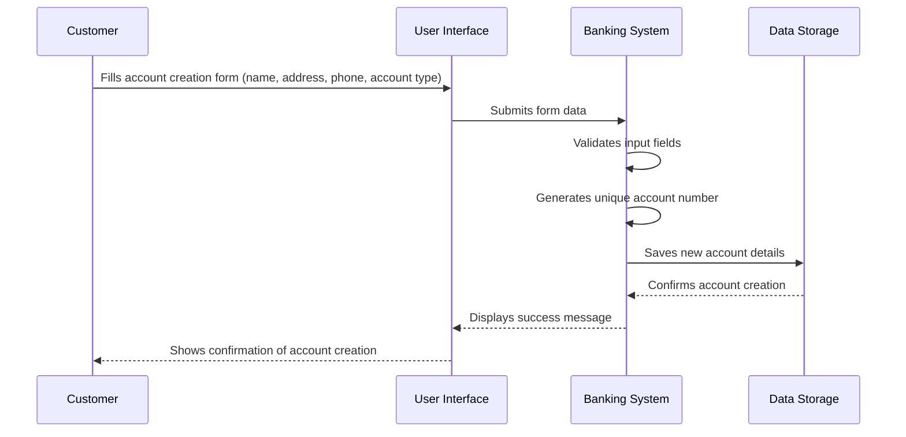
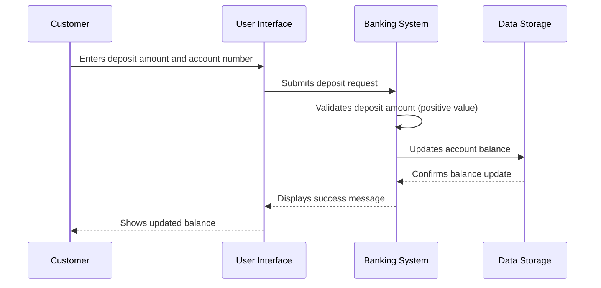
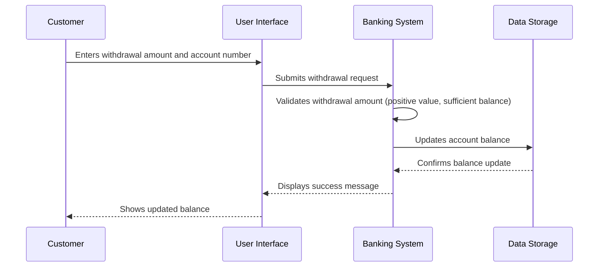
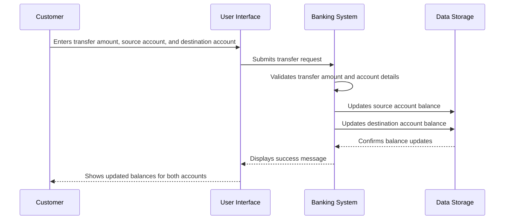
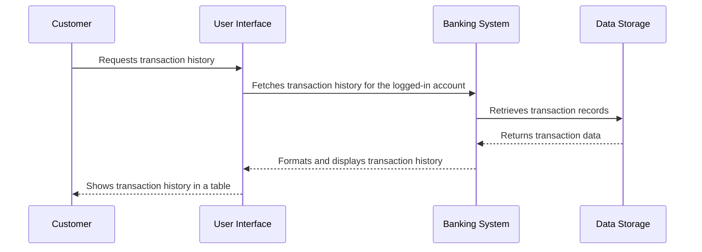
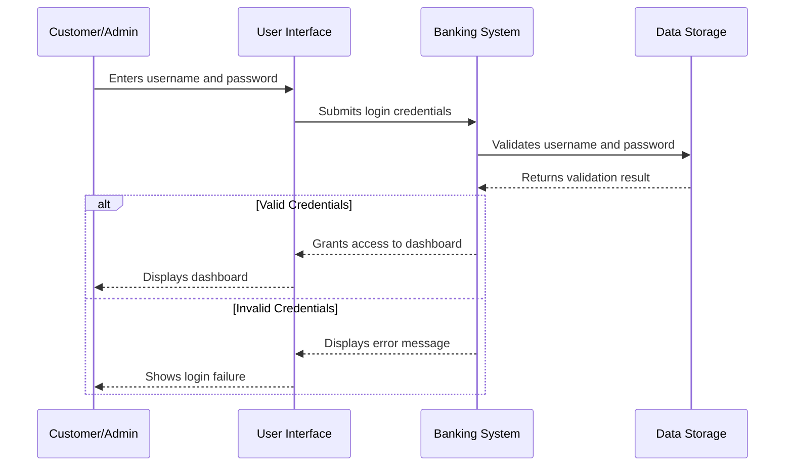
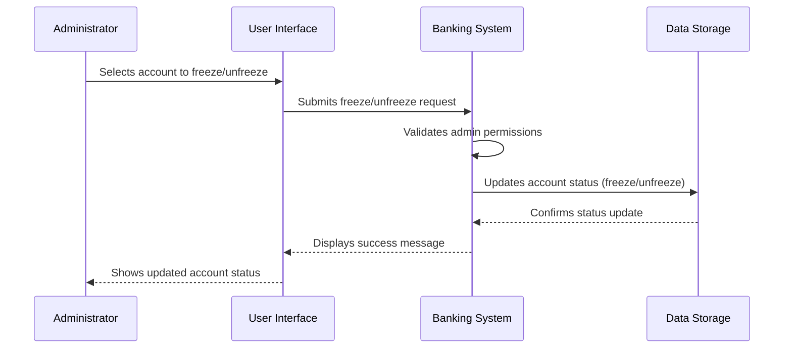
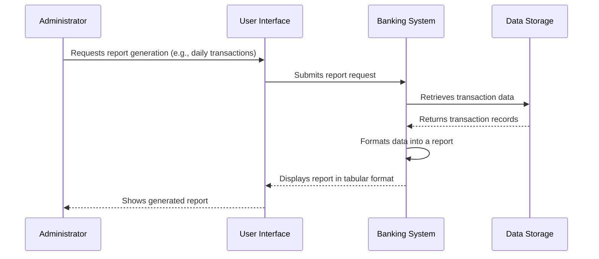
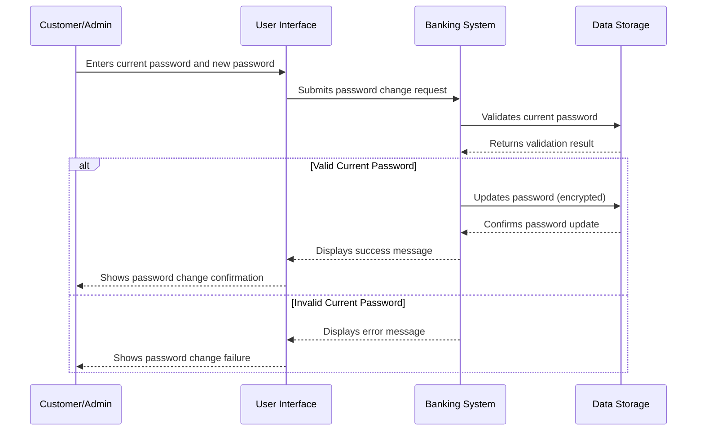
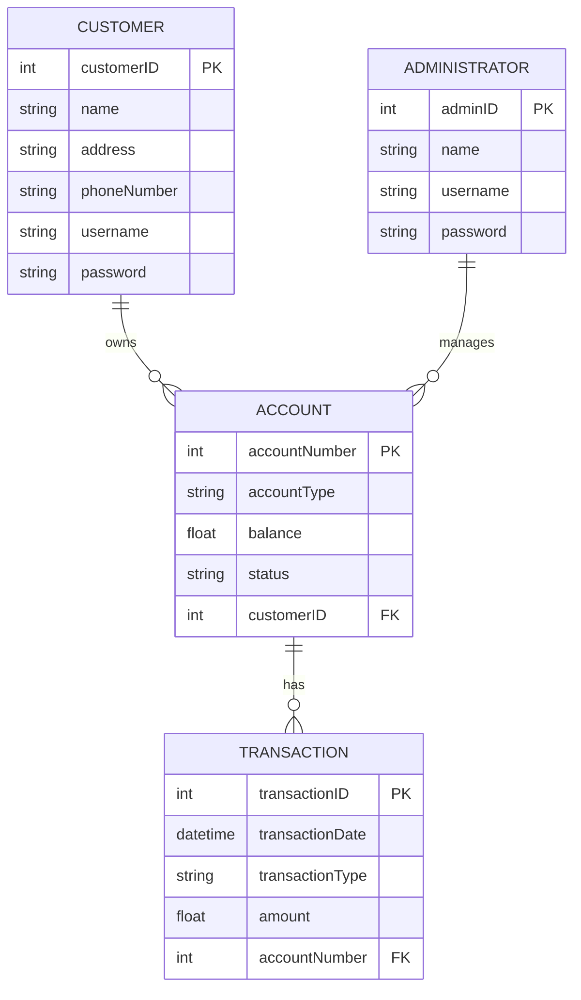

Below are the **sequence diagrams** in **Mermaid format** for the key use cases of the Banking System. These diagrams illustrate the interactions between the **User**, **System**, and other components for each use case.
120,02,
### 1. **Create Account**

,
,,,,,,,,,,,,,,,,,,,,,,,,,,,,,,,,,,,,,,,,,,,,,,,,,,,,,,,,,,,### 2. **Deposit Money**


---

### 3. **Withdraw Money**


---

### 4. **Transfer Funds**


---

### 5. **View Transaction History**


---

### 6. **Login**


---

### 7. **Freeze Account (Admin)**


---

### 8. **Generate Reports (Admin)**


---

### 9. **Change Password**


---

These sequence diagrams provide a clear visual representation of the interactions between the user, system, and data storage for each use case. You can use these diagrams to better understand the flow of operations and implement them in your C++ project.

Below are the **use case diagrams** in **Mermaid format** for the Banking System. These diagrams illustrate the relationships between **actors** (Customer and Administrator) and the **use cases** they can perform.

---

### 1. **Use Case Diagram for Customer**
```mermaid
useCaseDiagram
    actor Customer
    Customer : (Create Account)
    Customer : (Deposit Money)
    Customer : (Withdraw Money)
    Customer : (Transfer Funds)
    Customer : (View Transaction History)
    Customer : (Change Password)
    Customer : (Login)

    Customer --> (Create Account)
    Customer --> (Deposit Money)
    Customer --> (Withdraw Money)
    Customer --> (Transfer Funds)
    Customer --> (View Transaction History)
    Customer --> (Change Password)
    Customer --> (Login)
```

---

### 2. **Use Case Diagram for Administrator**
```mermaid
useCaseDiagram
    actor Administrator
    Administrator : (View All Accounts)
    Administrator : (Freeze Account)
    Administrator : (Generate Reports)
    Administrator : (Change Password)
    Administrator : (Login)

    Administrator --> (View All Accounts)
    Administrator --> (Freeze Account)
    Administrator --> (Generate Reports)
    Administrator --> (Change Password)
    Administrator --> (Login)
```

---

### 3. **Combined Use Case Diagram for Customer and Administrator**
```mermaid
useCaseDiagram
    actor Customer
    actor Administrator

    Customer : (Create Account)
    Customer : (Deposit Money)
    Customer : (Withdraw Money)
    Customer : (Transfer Funds)
    Customer : (View Transaction History)
    Customer : (Change Password)
    Customer : (Login)

    Administrator : (View All Accounts)
    Administrator : (Freeze Account)
    Administrator : (Generate Reports)
    Administrator : (Change Password)
    Administrator : (Login)

    Customer --> (Create Account)
    Customer --> (Deposit Money)
    Customer --> (Withdraw Money)
    Customer --> (Transfer Funds)
    Customer --> (View Transaction History)
    Customer --> (Change Password)
    Customer --> (Login)

    Administrator --> (View All Accounts)
    Administrator --> (Freeze Account)
    Administrator --> (Generate Reports)
    Administrator --> (Change Password)
    Administrator --> (Login)
```

---

### 4. **Use Case Diagram with Relationships**
This diagram shows relationships between use cases, such as **extend** and **include** relationships.

```mermaid
useCaseDiagram
    actor Customer
    actor Administrator

    Customer : (Create Account)
    Customer : (Deposit Money)
    Customer : (Withdraw Money)
    Customer : (Transfer Funds)
    Customer : (View Transaction History)
    Customer : (Change Password)
    Customer : (Login)

    Administrator : (View All Accounts)
    Administrator : (Freeze Account)
    Administrator : (Generate Reports)
    Administrator : (Change Password)
    Administrator : (Login)

    Customer --> (Create Account)
    Customer --> (Deposit Money)
    Customer --> (Withdraw Money)
    Customer --> (Transfer Funds)
    Customer --> (View Transaction History)
    Customer --> (Change Password)
    Customer --> (Login)

    Administrator --> (View All Accounts)
    Administrator --> (Freeze Account)
    Administrator --> (Generate Reports)
    Administrator --> (Change Password)
    Administrator --> (Login)

    (Login) <.. (Change Password) : <<extend>>
    (Deposit Money) <.. (View Transaction History) : <<include>>
    (Withdraw Money) <.. (View Transaction History) : <<include>>
    (Transfer Funds) <.. (View Transaction History) : <<include>>
```

---

### Explanation of Relationships:
1. **<<extend>>**:
   - The **Change Password** use case extends the **Login** use case because changing a password is an optional action that can only occur after logging in.

2. **<<include>>**:
   - The **View Transaction History** use case includes **Deposit Money**, **Withdraw Money**, and **Transfer Funds** because these transactions are recorded and displayed in the transaction history.

---

These use case diagrams provide a clear visual representation of the interactions between actors (Customer and Administrator) and the use cases they can perform. You can use these diagrams to better understand the system's functionality and implement it in your C++ project.

Below is the **Entity-Relationship Diagram (ERD)** for the Banking System, along with an explanation of the entities, attributes, and relationships. The ERD is represented in **Mermaid format** for easy visualization.

---

## Entity-Relationship Diagram (ERD) in Mermaid Format



---

## Explanation of the ERD

### 1. **Entities**
Entities represent the key objects or concepts in the system. In this Banking System, the main entities are:

#### a. **CUSTOMER**
- Represents a bank customer.
- **Attributes**:
  - `customerID` (Primary Key): Unique identifier for each customer.
  - `name`: Full name of the customer.
  - `address`: Address of the customer.
  - `phoneNumber`: Contact number of the customer.
  - `username`: Username for logging into the system.
  - `password`: Encrypted password for authentication.

#### b. **ACCOUNT**
- Represents a bank account owned by a customer.
- **Attributes**:
  - `accountNumber` (Primary Key): Unique identifier for each account.
  - `accountType`: Type of account (e.g., Savings, Current).
  - `balance`: Current balance in the account.
  - `status`: Status of the account (e.g., Active, Frozen).
  - `customerID` (Foreign Key): Links the account to a specific customer.

#### c. **TRANSACTION**
- Represents a financial transaction performed on an account.
- **Attributes**:
  - `transactionID` (Primary Key): Unique identifier for each transaction.
  - `transactionDate`: Date and time of the transaction.
  - `transactionType`: Type of transaction (e.g., Deposit, Withdrawal, Transfer).
  - `amount`: Amount involved in the transaction.
  - `accountNumber` (Foreign Key): Links the transaction to a specific account.

#### d. **ADMINISTRATOR**
- Represents a bank employee who manages customer accounts.
- **Attributes**:
  - `adminID` (Primary Key): Unique identifier for each administrator.
  - `name`: Full name of the administrator.
  - `username`: Username for logging into the system.
  - `password`: Encrypted password for authentication.

---

### 2. **Relationships**
Relationships define how entities interact with each other.

#### a. **CUSTOMER owns ACCOUNT**
- A **CUSTOMER** can own one or more **ACCOUNTs**.
- This is a **one-to-many** relationship.
- Represented as `CUSTOMER ||--o{ ACCOUNT`.

#### b. **ACCOUNT has TRANSACTION**
- An **ACCOUNT** can have one or more **TRANSACTIONs**.
- This is a **one-to-many** relationship.
- Represented as `ACCOUNT ||--o{ TRANSACTION`.

#### c. **ADMINISTRATOR manages ACCOUNT**
- An **ADMINISTRATOR** can manage one or more **ACCOUNTs**.
- This is a **one-to-many** relationship.
- Represented as `ADMINISTRATOR ||--o{ ACCOUNT`.

---

### 3. **Attributes**
- **Primary Key (PK)**: A unique identifier for each entity (e.g., `customerID`, `accountNumber`).
- **Foreign Key (FK)**: A field that links one entity to another (e.g., `customerID` in **ACCOUNT** links to **CUSTOMER**).
- **Other Attributes**: Descriptive properties of the entities (e.g., `name`, `balance`, `transactionType`).

---

### 4. **Key Points**
- **CUSTOMER** and **ADMINISTRATOR** are separate entities because they have different roles and attributes.
- **ACCOUNT** is central to the system, linking **CUSTOMER** and **TRANSACTION**.
- **TRANSACTION** records all financial activities, ensuring traceability and accountability.

---

## Example Data

### CUSTOMER Table
| customerID | name          | address           | phoneNumber   | username | password (encrypted) |
|------------|---------------|-------------------|---------------|----------|----------------------|
| 1          | John Doe      | 123 Main St       | 555-1234      | johndoe  | ********             |
| 2          | Jane Smith    | 456 Elm St        | 555-5678      | janesmith| ********             |

### ACCOUNT Table
| accountNumber | accountType | balance | status  | customerID |
|---------------|-------------|---------|---------|------------|
| 1001          | Savings     | 5000.00 | Active  | 1          |
| 1002          | Current     | 2500.00 | Frozen  | 2          |

### TRANSACTION Table
| transactionID | transactionDate       | transactionType | amount | accountNumber |
|---------------|-----------------------|-----------------|--------|---------------|
| 1             | 2023-10-01 10:00:00   | Deposit         | 1000.00| 1001          |
| 2             | 2023-10-02 11:30:00   | Withdrawal      | 500.00 | 1001          |

### ADMINISTRATOR Table
| adminID | name          | username | password (encrypted) |
|---------|---------------|----------|----------------------|
| 1       | Admin User    | admin    | ********             |

---

## Summary
The ERD provides a clear and structured representation of the Banking System's data model. It defines the entities, their attributes, and the relationships between them. This diagram serves as a blueprint for designing the database schema and implementing the system in C++.

```mermaid
flowchart TD
    A[Start Server] --> B[Initialize Server State]
    B --> C[Create Server Socket]
    C --> D{Server Running?}
    D -->|Yes| E[Accept New Connection]
    E --> F{Is Connection Valid?}
    F -->|Yes| G{Is Max Connections Reached?}
    G -->|No| H[Add New Client/Admin]
																																																				   G -->|Yes| I[Close Connection]0 n                                              1q
    H --> J[Handle Existing Connections]
    I --> J
    F -->|No| J
    J --> K{Has Data from Client/Admin?}
    K -->|Yes| L[Receive Request]
    L --> M{Is Authenticated?}
    M -->|No| N[Authenticate User/Admin]
    N --> O{Authentication Successful?}
    O -->|Yes| P[Mark as Authenticated]
    O -->|No| Q[Send Authentication Failed Response]
    Q --> J
    P --> R[Process Request]
    M -->|Yes| R
    R --> S[Send Response]
    S --> J
    K -->|No| T[Check for Timeouts]
    T --> U[Remove Inactive Clients/Admins]
    U --> V[Log Server Activity]
    V --> W[Sleep to Avoid Busy-Waiting]
    W --> D
    D -->|No| X[Stop Server]
    X --> Y[End]
```
Here are the SQL queries to create a database that matches the ERD description provided:

```sql
-- Create CUSTOMER table
CREATE TABLE CUSTOMER (
    customerID INT AUTO_INCREMENT PRIMARY KEY,
    name VARCHAR(100) NOT NULL,
    address VARCHAR(200) NOT NULL,
    phoneNumber VARCHAR(20) NOT NULL,
    username VARCHAR(50) UNIQUE NOT NULL,
    password VARCHAR(100) NOT NULL DEFAULT 'Encrypted Password Required'
);

-- Create ACCOUNT table
CREATE TABLE ACCOUNT (
    accountNumber INT AUTO_INCREMENT PRIMARY KEY,
    accountType ENUM('Savings', 'Current') NOT NULL,
    balance DECIMAL(10, 2) NOT NULL CHECK (balance >= 0),
    status ENUM('Active', 'Frozen') DEFAULT 'Active',
    customerID INT NOT NULL,
    FOREIGN KEY (customerID) REFERENCES CUSTOMER(customerID)
);

-- Create TRANSACTION table
CREATE TABLE TRANSACTION (
    transactionID BIGINT AUTO_INCREMENT PRIMARY KEY,
    transactionDate DATETIME NOT NULL,
    transactionType ENUM('Deposit', 'Withdrawal', 'Transfer') NOT NULL,
    amount DECIMAL(10, 2) NOT NULL CHECK (amount > 0),
    accountNumber INT NOT NULL,
    FOREIGN KEY (accountNumber) REFERENCES ACCOUNT(accountNumber)
);

-- Create ADMINISTRATOR table
CREATE TABLE ADMINISTRATOR (
    adminID INT AUTO_INCREMENT PRIMARY KEY,
    name VARCHAR(100) NOT NULL,
    username VARCHAR(50) UNIQUE NOT NULL,
    password VARCHAR(100) NOT NULL DEFAULT 'Encrypted Password Required'
);

-- Indexes on foreign keys for better performance
CREATE INDEX idx_customerID ON ACCOUNT (customerID);
CREATE INDEX idx_accountNumber ON TRANSACTION (accountNumber);
```

### Notes:
- Primary keys are marked with `PRIMARY KEY` and auto-incremented using `AUTO_INCREMENT`.
- Foreign keys are used to establish relationships between tables.
- The password field is stored as a string, but in a real-world scenario, it should be properly 
encrypted using secure hashing algorithms before storing.
- Constraints like `NOT NULL`, `UNIQUE`, `CHECK`, and `DEFAULT` are included where appropriate.
- Indexes on foreign keys are created for better query performance.

This set of SQL statements creates all the necessary tables with their relationships and constraints 
as described in your ERD.

## Script to generate data for the DB

```python
import json
import random
from faker import Faker
from datetime import datetime, timedelta

# Initialize Faker for generating realistic fake data
fake = Faker()

def generate_random_data(num_customers=10):
    # Create a list to hold all the generated data
    data = {
        "customers": [],
        "accounts": [],
        "transactions": []
    }

    # Generate random customers, accounts, and transactions
    for customer_id in range(1, num_customers + 1):
        # Random customer data
        customer = {
            "customerID": customer_id,
            "name": fake.name(),
            "address": fake.address().replace("\n", " "),
            "phoneNumber": fake.phone_number(),
            "username": f"{fake.first_name().lower()}{random.randint(1, 999)}",
            "password": "Encrypted Password Required"  # Placeholder for encrypted password
        }
        data["customers"].append(customer)

        # Create an account for the customer
        account = {
            "accountNumber": len(data["accounts"]) + 1,
            "accountType": random.choice(['Savings', 'Current']),
            "balance": round(random.uniform(0, 100000), 2),
            "status": 'Active',
            "customerID": customer_id
        }
        data["accounts"].append(account)

        # Generate random transactions for the account
        num_transactions = random.randint(5, 15)  # 5-15 transactions per account
        for transaction_id in range(1, num_transactions + 1):
            transaction_date = fake.date_time_between(start_date='-1Y', end_date='now')
            transaction_type = random.choice(['Deposit', 'Withdrawal', 'Transfer'])
            
            if account["accountType"] == "Savings":
                max_withdrawal = account.get("balance", 0)
                amount = round(random.uniform(1, min(max_withdrawal, 500)), 2)  # Maximum $500 per transaction
            else:
                amount = round(random.uniform(1, 2000), 2)  # Current accounts can have larger transactions
            
            if transaction_type == 'Withdrawal' and account["accountType"] == "Savings":
                amount = min(amount, account["balance"])
            
            transaction = {
                "transactionID": len(data["transactions"]) + 1,
                "transactionDate": transaction_date.strftime('%Y-%m-%d %H:%M:%S'),
                "transactionType": transaction_type,
                "amount": amount,
                "accountNumber": account["accountNumber"]
            }
            data["transactions"].append(transaction)

    return data

def save_to_json(data, filename="bank_data.json"):
    with open(filename, 'w') as f:
        json.dump(data, indent=2, ensure_ascii=False)
        print(f"Data saved to {filename}")

if __name__ == "__main__":
    num_customers = int(input("Enter the number of customers to generate: "))
    generated_data = generate_random_data(num_customers)
    save_to_json(generated_data)
```

### Explanation:
1. **Fake Data Generation**:
   - Uses `Faker` library to generate realistic fake names, addresses, and phone numbers.
   - Random usernames are created by combining first names with random numbers.

2. **Customer Accounts**:
   - Each customer gets a unique account number.
   - Account type is randomly chosen between 'Savings' and 'Current'.
   - Initial balance is randomized between $0 and $100,000.

3. **Transactions**:
   - Generates 5-15 transactions per account.
   - Transaction dates are random within the last year.
   - Transactions types include Deposits, Withdrawals, and Transfers.
   - Amounts are reasonable for each account type (lower limits for Savings accounts).

4. **JSON Output**:
   - Data is structured in a JSON file with separate sections for customers, accounts, and transactions.
   - File is saved with indentation for readability.

### Requirements:
- Install the `Faker` library if you haven't already:
  ```bash
  pip install faker
  ```

This script will create a realistic dataset of customers, their accounts, and transaction history. You can adjust the number of customers (N) when 
running the script to generate more or fewer records.

Example usage:
```python
# Generate data for 50 customers
generated_data = generate_random_data(50)
save_to_json(generated_data, "bank_dataset.json")
```

This will create a JSON file named `bank_dataset.json` with all the generated data.
